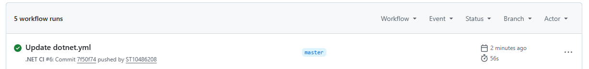

# CyberSecurityChatbot

CyberSafe Buddy is a beginner-friendly cybersecurity chatbot built in C#.

## Features
- ASCII art logo
- Audio greeting
- User input handling
- Cybersecurity tips
- Simple chatbot responses

## How to Run
1. Open the project in Visual Studio
2. Build and run the program
3. Follow the chatbot prompts

## Purpose
This project was created to demonstrate basic programming concepts and raise cybersecurity awareness.

## CI Screenshot

